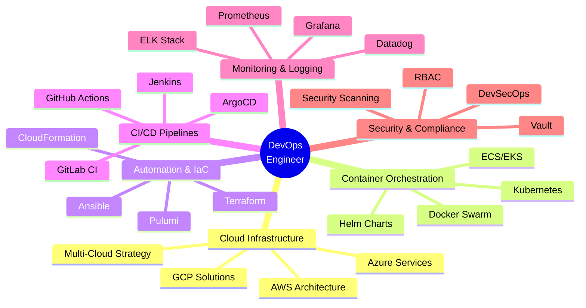

<div align="center">

# 👋 Hello, I'm Sagar Bawanthade


[](https://github.com/SagarBawanthade)
[](https://github.com/SagarBawanthade)
[](https://linkedin.com/in/sagarbawanthade)
[](https://sagarbawanthade.dev)

</div>

---

## 💻 MacOS Terminal Session

<div align="center">


</div>

<div align="center">

### 📟 Quick Terminal Commands

```bash
# System Information
sagar@MacBook-Pro ~ % system_profiler
━━━━━━━━━━━━━━━━━━━━━━━━━━━━━━━━━━━━━━━━━━━━━━━━━━━━━━━━
👤 User: Sagar Bawanthade
💼 Role: Cloud & DevOps Engineer
📍 Location: Pimpri, Maharashtra, India
🌐 Portfolio: sagarbawanthade.dev
📧 Email: sagar.bawanthade2004@gmail.com
━━━━━━━━━━━━━━━━━━━━━━━━━━━━━━━━━━━━━━━━━━━━━━━━━━━━━━━━

# Skills Inventory
sagar@MacBook-Pro ~ % ls -la ~/skills/
drwxr-xr-x  ☸️  kubernetes/          # Container Orchestration
drwxr-xr-x  🏗️  terraform/           # Infrastructure as Code
drwxr-xr-x  ☁️  aws-azure-gcp/       # Multi-Cloud Platforms
drwxr-xr-x  🔄 ci-cd-pipelines/     # Automation & DevOps
drwxr-xr-x  📊 monitoring/          # Observability Tools
drwxr-xr-x  🛡️  security/            # DevSecOps Practices

# Current Status
sagar@MacBook-Pro ~ % ps aux | grep current_focus
→ Building resilient, scalable cloud-native systems
→ Automating infrastructure at enterprise scale
→ Mastering Kubernetes & service mesh technologies

sagar@MacBook-Pro ~ % █
```

</div>

---

<div align="center">

## 🎯 Professional Snapshot

<table>
<tr>
<td align="center" width="33%">

### 🚀 **500+**
**Automated Deployments**

</td>
<td align="center" width="33%">

### ☸️ **100+**
**Kubernetes Clusters Managed**

</td>
<td align="center" width="33%">

### ⚡ **70%**
**Deployment Time Reduction**

</td>
</tr>
</table>

</div>

---

## 🛠️ Technology Arsenal

<div align="center">

### ☁️ Cloud Platforms & Infrastructure

<p>


</p>

### 🐳 Container & Orchestration

<p>


</p>

### 🏗️ Infrastructure as Code

<p>


</p>

### 🔄 CI/CD & Automation

<p>


</p>

### 📊 Monitoring & Observability

<p>


</p>

### 💻 Programming & Scripting

<p>


</p>

### 🗄️ Databases & Caching

<p>


</p>

### 🌐 Web Servers & Reverse Proxy

<p>


</p>

### 🔐 Security & Secrets Management

<p>


</p>

### 🛠️ Version Control & Tools

<p>


</p>

### 🖥️ Operating Systems

<p>


</p>

### ☁️ Service Mesh & Message Queue

<p>


</p>

</div>

---

<div align="center">

## 📊 GitHub Analytics Dashboard


</div>

---

<div align="center">

## 🏆 GitHub Achievements & Trophies


</div>

---

## 💼 Professional Journey & Expertise

<div align="center">



</div>

---

## 🌟 Featured Projects & Impact

<div align="center">

<table>
<tr>
<td align="center" width="50%">

### ☸️ Kubernetes Multi-Cluster Platform
**Tech:** Kubernetes, Terraform, ArgoCD, Istio

✅ Automated deployment of production-grade K8s clusters  
✅ Implemented GitOps workflows with ArgoCD  
✅ Service mesh integration for traffic management  
✅ Reduced deployment time by **70%**

</td>
<td align="center" width="50%">

### 🔄 Enterprise CI/CD Pipeline
**Tech:** Jenkins, Docker, Kubernetes, Helm

✅ Designed end-to-end automated pipelines  
✅ Integrated security scanning & testing  
✅ Multi-environment deployment strategy  
✅ **500+** successful automated deployments

</td>
</tr>
<tr>
<td align="center" width="50%">

### 📊 Observability Platform
**Tech:** Prometheus, Grafana, ELK, Loki

✅ Real-time monitoring for microservices  
✅ Custom dashboards & alerting rules  
✅ Centralized logging with ELK stack  
✅ **99.9%** uptime achieved

</td>
<td align="center" width="50%">

### 🏗️ Infrastructure as Code Framework
**Tech:** Terraform, Ansible, AWS, Python

✅ Managed **100+** cloud resources  
✅ Multi-region deployment automation  
✅ Cost optimization & resource tagging  
✅ Saved **40%** infrastructure costs

</td>
</tr>
</table>

</div>

---

## 🎓 Certifications & Learning

<div align="center">

```yaml
Certifications:
  ☁️  AWS_Certified: "Solutions Architect / DevOps Engineer"
  ☸️  Kubernetes: "CKA (Certified Kubernetes Administrator) - In Progress"
  🔐 Security: "Certified DevSecOps Professional"
  
Current_Learning_Path:
  - Advanced Kubernetes Patterns & Best Practices
  - Service Mesh Architecture (Istio & Linkerd)
  - GitOps with ArgoCD & FluxCD
  - Cloud-Native Security & Compliance
  - Multi-Cloud Strategy & Migration
  - Infrastructure Automation at Scale
  - Observability & SRE Practices
  
2024_Goals:
  ✓ Complete CKA Certification
  ✓ Master Service Mesh Technologies
  ✓ Contribute to Open Source Projects
  ✓ Build Production-Grade K8s Platform
  ✓ Mentor Aspiring DevOps Engineers
```

</div>

---

## 💡 DevOps Philosophy & Principles

<div align="center">

<table>
<tr>
<td align="center" width="33%">

### 🔄 Automate
**Everything Repeatable**

"If you do it twice,  
automate it once."

</td>
<td align="center" width="33%">

### 📊 Monitor
**Everything Important**

"You can't improve  
what you don't measure."

</td>
<td align="center" width="33%">

### 🛡️ Secure
**Everything Built**

"Security is not a feature,  
it's a foundation."

</td>
</tr>
</table>

### Core Values

**🚀 Speed** → Fast, reliable deployments  
**📈 Scale** → Systems that grow with demand  
**🔒 Security** → Built-in, not bolted-on  
**🔧 Simplicity** → Complex systems, simple operations  
**🎯 Reliability** → Five nines or bust  
**🤝 Collaboration** → Breaking silos, building teams

</div>

---

## 🌐 Connect & Collaborate

<div align="center">

<p>
<a href="https://linkedin.com/in/sagarbawanthade"></a>
<a href="https://twitter.com/sagar2004_twts"></a>
<a href="https://instagram.com/sagarbawanthade_30"></a>
<a href="mailto:sagar.bawanthade2004@gmail.com"></a>
<a href="https://sagarbawanthade.dev"></a>
</p>

### 📫 Let's Build Something Amazing!

💼 **Open for:** DevOps/SRE Roles | Consulting | Freelance Projects  
🤝 **Available for:** Technical Mentorship | Code Reviews | Architecture Discussions  
☕ **Coffee Chat:** Always up for tech discussions & collaboration


</div>

---

<div align="center">

## 📈 Detailed Activity & Contributions

[](https://github.com/SagarBawanthade)

---


---


### ⭐ From [SagarBawanthade](https://github.com/SagarBawanthade)

**Building Reliable Systems | Automating Infrastructure | Scaling with Confidence**

*One commit at a time, one deployment at a time, one solution at a time.* 🚀

---


</div>
