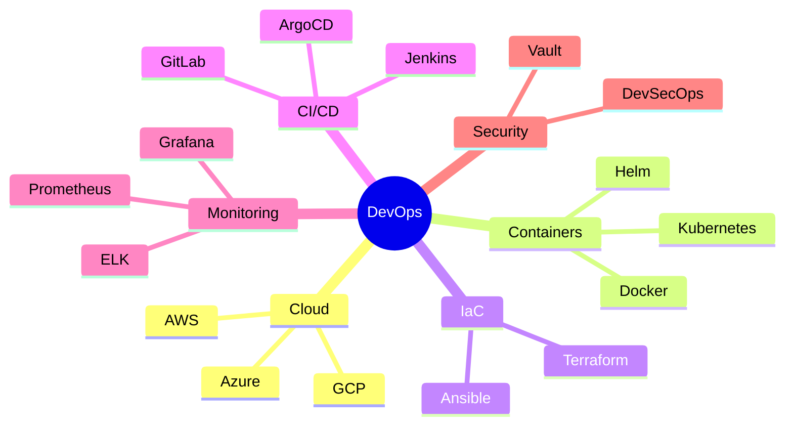

<div align="center">

# 👨‍💻 Sagar Bawanthade


[](https://github.com/SagarBawanthade)
[](https://github.com/SagarBawanthade)
[](https://linkedin.com/in/sagarbawanthade)

</div>

---

## 💻 MacOS Terminal

<div align="center">


</div>

---

<div align="center">

## 🎯 Impact Metrics

<table>
<tr>
<td align="center" width="33%">

### ⚡ **70%**
**Faster Deployments**

</td>
<td align="center" width="33%">

### ☸️ **100+**
**K8s Clusters Managed**

</td>
<td align="center" width="33%">

### 🚀 **500+**
**Automated Pipelines**

</td>
</tr>
</table>

</div>

---

## 🛠️ Tech Stack & Tools

<div align="center">

### ☁️ Cloud Platforms

<p>


</p>

### 🐳 Container & Orchestration

<p>


</p>

### 🏗️ Infrastructure as Code

<p>


</p>

### 🔄 CI/CD & Automation

<p>


</p>

### 📊 Monitoring & Observability

<p>


</p>

### 💻 Languages & Scripting

<p>


</p>

### 🗄️ Databases

<p>


</p>

### 🔧 Tools & Platforms

<p>


</p>

</div>

---

## 📊 GitHub Stats

<div align="center">


</div>

---

## 🏆 Achievements

<div align="center">


</div>

---

## 💼 Expertise Areas

<div align="center">



</div>

---

## 🚀 Featured Projects

<div align="center">

| Project | Tech Stack | Impact |
|---------|------------|--------|
| **K8s Automation Platform** | Kubernetes, Terraform, ArgoCD | 70% faster deployments |
| **Multi-Cloud Infrastructure** | AWS, Azure, Terraform | 100+ resources managed |
| **CI/CD Pipeline Framework** | Jenkins, Docker, K8s | 500+ automated builds |
| **Monitoring Stack** | Prometheus, Grafana, ELK | 99.9% uptime achieved |

</div>

---

## 🎓 Current Focus

<div align="center">

```yaml
learning:
  - Advanced Kubernetes Patterns
  - Service Mesh (Istio)
  - GitOps Workflows
  - Cloud-Native Security
  
building:
  - Production-Grade K8s Platform
  - Infrastructure Automation Framework
  - Multi-Cloud Solutions
```

</div>

---

## 💡 Philosophy

<div align="center">

> **"Automate Everything. Monitor Everything. Scale Everything."**

### Core Values

**🔄 Automation** • **📈 Scalability** • **🛡️ Security** • **📊 Observability** • **🚀 Reliability**

</div>

---

## 🌐 Connect

<div align="center">

<a href="https://linkedin.com/in/sagarbawanthade"></a>
<a href="https://twitter.com/sagar2004_twts"></a>
<a href="mailto:sagar.bawanthade2004@gmail.com"></a>
<a href="https://sagarbawanthade.dev"></a>

---

**💼 Open for DevOps/SRE opportunities | 🤝 Available for consulting**

---


**⭐ From [SagarBawanthade](https://github.com/SagarBawanthade) | Automating Infrastructure, One Commit at a Time**

</div>
